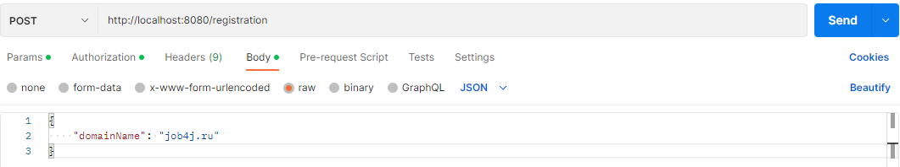
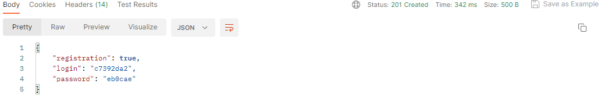
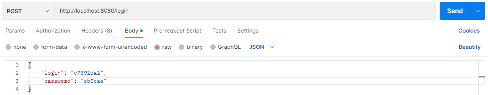
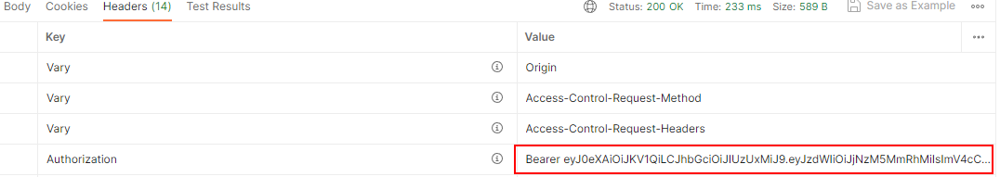
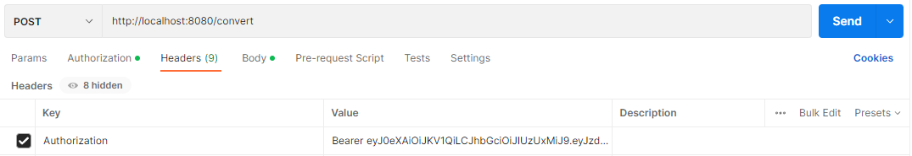
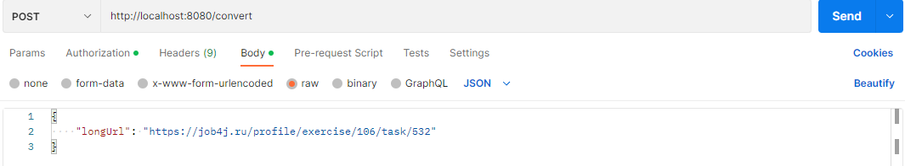
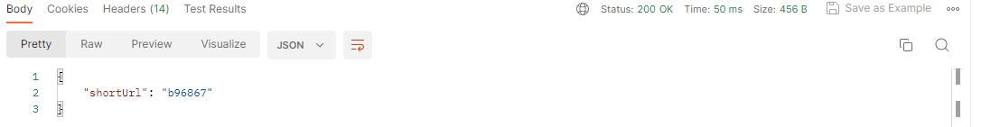
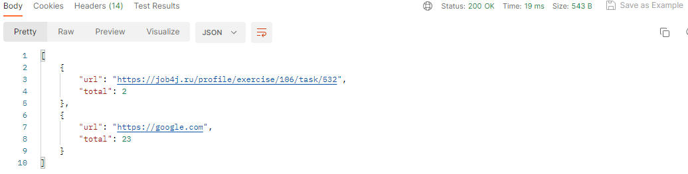

# job4j_url_shortcut

## Описание проекта

* RESTful WEB-сервис, представляющий собой генератор коротких ссылок.
* Реализована регистрация пользователей, авторизация через JWT.
* Зарегистрированные пользователи могут сохранять URL-адреса и получать статистику по ним.
* Переадресация доступна неавторизованным пользователям. 

## Стек технологий

- **Java 17.0.2**
- **Spring Boot 2.7.8**
- **Spring Data JPA 2.7.8**
- **Spring Security 5.7.6**
- **JWT 3.4.0**
- **Lombok 1.18.24**
- **PostgreSQL 15**
- **Liquibase 4.15.0**
- **H2DB 2.1.214**
- **Junit 5.8.2**
- **Mockito 4.5.1**
- **Maven 3.8.1**
- **Docker 23.03.3**

## Требования к окружению

- **Java 17.0.2**
- **Maven 3.8.1**
- **PostgresSQL 15**
- **Postman**

## Сборка и запуск

## Используя Kubernetes

- **Скачать образ с hub.docker.com**
```
docker pull egorbekhterev/url_shortener_k8s
```

- **Перейти в пакет k8s в директории проекта**
```
cd k8s
```

- **Сделать скрипт развертывания исполняемым**
```
chmod +x command.sh
```

- **Выполнить сборку проекта**
```
./command.sh
```

- **Размер требуемых для запуска образов**
```
postgres 379MB
url_shortener 517MB
```

## Используя Docker

- **Скачать образ с hub.docker.com**
```
docker pull egorbekhterev/url_shortener
```

- **Выполнить сборку проекта**
```
docker-compose build
```

- **Запустить**
```
docker-compose up -d
```

- **Размер требуемых для запуска образов**
```
postgres 379MB
url_shortener 517MB
```

## Используя Terminal

- **Создать БД**

``` 
create database url_shortcut;
```

- **Запустить проект по команде**

``` 
mvn spring-boot:run -Pproduction
```

- **Использовать Postman или другой API для выполнения запросов.**

``` 
http://localhost:8080/
```

## Взаимодействие с приложением

### Регистрация сайта. Для использования всего функционала сервиса необходимо зарегистрировать сайт.
``` 
POST /registration
```
### Передаем тело JSON объекта в следующем виде. Реализована валидация названия домена.


### Получаем ответ:


### Чтобы зарегистрировать URL-адрес, необходимо выполнить авторизацию с помощью JSON WEB TOKEN. Для этого:
``` 
POST /login
```
### Передаем в теле JSON объекта сгенерированные login и password:


### Получаем из заголовка JWT-токен:


### Регистрация URL.
``` 
POST /convert
```
### В поле Authorization заголовка помещаем полученный JWT-токен.


### Отправляем URL. Ссылка должна соответствовать формату веб-сайта, иначе не будет пройдена валидация.


### Ответ от сервера:


### Переадресация. Выполняется без авторизации. В переменную пути добавляем shortURL.
``` 
GET /redirect/{ SHORT_URL }
```


### В качестве ответа будет произведен переход на страницу сайта.

### Статистика. Для получения данных о количестве переходов по ссылкам необходимо авторизоваться и выполнить запрос:
``` 
GET /statistic
```
### Ответ от сервера JSON:


## Контакты для связи
telegram: <a href="https://t.me/bekhterev_egor" target="blank">@bekhterev_egor</a>
